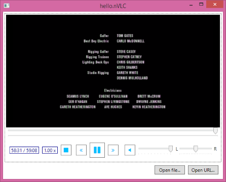

# hello.nVLC

A minimal WPF media player comparing VLC and Windows Media Player using
[nVLC](https://www.nuget.org/packages/nVLC/), [VLC.Native](https://www.nuget.org/packages/VLC.Native/) and [FontAwesome.Sharp](http://www.nuget.org/packages/FontAwesome.Sharp/).

Actually, the VLC dependency package is quite big, so maybe the player is not so minimalistic altogether.  

