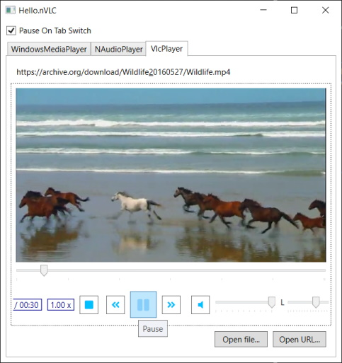

# hello.nVLC

A minimal WPF media player comparing [VLC](https://www.videolan.org/vlc/index.html), [Windows Media Player](https://en.wikipedia.org/wiki/Windows_Media_Player) and [NAudio](https://github.com/naudio/NAudio) using
[nVLC](https://www.nuget.org/packages/nVLC/), [VLC.Native](https://www.nuget.org/packages/VLC.Native/) and [FontAwesome.Sharp](http://www.nuget.org/packages/FontAwesome.Sharp/).



## VLC.Native

Actually, the VLC dependency package is quite big (~ 320MB, 166 MB each for x86/x64), so maybe the player is not so minimalistic altogether.
When using `VLC.Native` together with [Continuous Testing](https://en.wikipedia.org/wiki/Continuous_testing) Tools (e.g. [NCrunch](https://www.ncrunch.net/))
you may consider disabling the large footprint of the native VLC dependencies by setting

```xml
<PropertyGroup>
  <!-- set to anything different than '', e.g. 1 -->
  <DisableVlcNative>$(NCrunch)</DisableVlcNative>
</PropertyGroup>
```

Here we used NCrunch-specific build properties but any value other than `''` will cause `VLC.Native` to skip including
the native dependencies as content to your build, c.f.

- [NCrunch-Specific Overrides](https://www.ncrunch.net/documentation/troubleshooting_ncrunch-specific-overrides)
- [NCrunch Build Properties](https://www.ncrunch.net/documentation/troubleshooting_ncrunch-build-properties)
